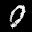
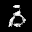
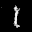

# PyTorch Implementation of *Improved Techniques for Traning GANs*

This is the extension of my [PyTorchDCGAN](https://github.com/TomatoPope0/PyTorchDCGAN) repository, adopting techniques and suggested metric from Salimans *et al.* [1]. Escpecially, I'll test my model on
the following datasets:

- MNIST [2]
- CelebA [3], cropped
- LSUN [4]
- Danboru2019 [5], SFW, downscaled

and compare the output with naive DCGAN [6], both qualitatively and quantitatively. However, due to the limitation on my access to the hardware, some of the planned experiments may not be performed.

## Disclaimer

As I'm an active learning student, this implementation may not be complete or accurate. Therefore, I recommend you to use other reliable implementations if you're willing to use it in your project.

## To-Do

Though I marked minibatch discrimination as implemented, it needs more optimizations. For example, in matrix subtraction, it requires a lot of memories.

- [x] Feature Matching
- [x] Minibatch Discrimination
- [ ] Historical Averaging
- [x] One-sided Label Smoothing
- [ ] Virtual Batch Normalization

## Model Outputs

### MNIST

#### Single epoch with Feature Matching

#### 10 epochs with Feature Matching

Unfortunately, as vanilla DCGAN [6] did, the generator still collapsed on a small dataset of MNIST [2].

#### Single epoch with Minibatch Discrimination

Compared to vanilla DCGAN [6], images look more connected/filled, though it looks less like the actual numbers.

## References

- [1] T. Salimans, I. Goodfellow, W. Zaremba, V. Cheung, A. Radford, and X. Chen, "Improved Techniques for Training GANs," in *NIPS 2016*, D. D. Lee, M. Sugiyama, U. V. Luxburg, I. Guyon, and R. Garnett, 2016, pp. 2234-2242.
- [2] Y. LeCun, L. Bottou, Y. Bengio, and P. Haffner, "Gradient-based learning applied to document recognition." in *Proc. IEEE*, Nov. 1998, pp. 2278-2324.
- [3] Z. Liu, P. Luo, X. Wang, and X. Tang, "Deep Learning Face Attributes in the Wild," in *Proc. ICCV*, Dec. 2015.
- [4] F. Yu, Y. Zhang, S. Song, A. Seff, and J. Xiao, "LSUN: Construction of a Large-scale Image Dataset using Deep Learning with Humans in the Loop," 2015, *arXiv:1506.03365*.
- [5] Anonymous, and Danbooru Community, and G. Branwen, Jan. 2020, "Danbooru2019: A Large-Scale Crowdsourced and Tagged Anime Illustration Dataset," Web. [Online]. Available: https://www.gwern.net/Danbooru2019.
- [6] A. Radfold, L. Metz, and S. Chintala, "Unsupervised Representation Learning with Deep Convolutional Generative Adversarial Networks," 2015, *arXiv:1511.06434*.
